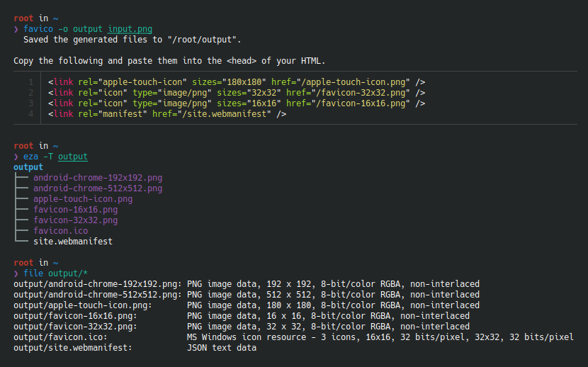

<!--
SPDX-FileCopyrightText: 2024 Shun Sakai

SPDX-License-Identifier: GPL-3.0-or-later
-->

# favico

[![CI][ci-badge]][ci-url]
[![Version][version-badge]][version-url]
![MSRV][msrv-badge]
![License][license-badge]

**favico** is a command-line utility for creating favicons.



## Installation

### From source

```sh
cargo install favico
```

### From binaries

The [release page] contains pre-built binaries for Linux, macOS and Windows.

### How to build

Please see [BUILD.adoc].

## Usage

### Basic usage

```sh
favico input.png
```

The following files will be generated in the current directory:

```text
.
├── android-chrome-192x192.png
├── android-chrome-512x512.png
├── apple-touch-icon.png
├── favicon-16x16.png
├── favicon-32x32.png
├── favicon.ico
└── site.webmanifest
```

### Generate shell completion

`--generate-completion` option generates shell completions to standard output.

The following shells are supported:

- `bash`
- `elvish`
- `fish`
- `nushell`
- `powershell`
- `zsh`

Example:

```sh
favico --generate-completion bash > favico.bash
```

## Command-line options

Please see the following:

- [`favico(1)`]

## Changelog

Please see [CHANGELOG.adoc].

## Contributing

Please see [CONTRIBUTING.adoc].

## License

Copyright &copy; 2024 Shun Sakai (see [AUTHORS.adoc])

1. This program is distributed under the terms of the _GNU General Public
   License v3.0 or later_.
2. Some files are distributed under the terms of the _Creative Commons
   Attribution 4.0 International Public License_.

This project is compliant with version 3.2 of the [_REUSE Specification_]. See
copyright notices of individual files for more details on copyright and
licensing information.

[ci-badge]: https://img.shields.io/github/actions/workflow/status/sorairolake/favico/CI.yaml?branch=develop&style=for-the-badge&logo=github&label=CI
[ci-url]: https://github.com/sorairolake/favico/actions?query=branch%3Adevelop+workflow%3ACI++
[version-badge]: https://img.shields.io/crates/v/favico?style=for-the-badge&logo=rust
[version-url]: https://crates.io/crates/favico
[msrv-badge]: https://img.shields.io/crates/msrv/favico?style=for-the-badge&logo=rust
[license-badge]: https://img.shields.io/crates/l/favico?style=for-the-badge
[release page]: https://github.com/sorairolake/favico/releases
[BUILD.adoc]: BUILD.adoc
[`favico(1)`]: https://sorairolake.github.io/favico/book/man/man1/favico.1.html
[CHANGELOG.adoc]: CHANGELOG.adoc
[CONTRIBUTING.adoc]: CONTRIBUTING.adoc
[AUTHORS.adoc]: AUTHORS.adoc
[_REUSE Specification_]: https://reuse.software/spec/
